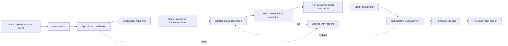

# Architecture

## Responsibilities

| Role | Responsibility | Authority |
|---|---|---|
| Project owner | Product intent, priorities, final risk decisions | Approve and merge |
| Codex architect | Turn intent into specifications, plans, ADRs, and review findings | Read, plan, review |
| Implementation agent | Produce a bounded patch from an approved specification | Edit isolated checkout only |
| Deterministic verifier | Build, lint, test, scan, and enforce invariants | Pass or fail |
| Publisher | Apply an approved patch and open a draft change request | Branch and draft PR/MR only |
| SCM provider | Audit trail, protected branches, checks, approvals | Enforce repository rules |

The automated Codex planner is a CI representation of the architect role. The
durable source of truth is the repository's issues, ADRs, policy file, plans,
and review history, not hidden model memory.

The initial decision is recorded in
[ADR 0001](adr/0001-separated-agentic-control-plane.md).

## Flow



## Components

### Portable core

The Python package owns behavior that must be identical on GitHub and GitLab:

- task parsing and required sections;
- normalized provider events;
- task eligibility;
- path, size, and risk policy;
- prompt boundaries for untrusted issue text;
- machine-readable decisions and audit output.

### Provider adapters

GitHub uses thin caller workflows and reusable workflows. GitLab uses a CI/CD
component plus a webhook-triggered pipeline. Provider adapters translate SCM
events into the same internal `WorkEvent` shape.

### Agent adapters

The pipeline supports separate agent roles:

- `codex`: preferred planner and reviewer, and an optional implementer;
- `claude`: optional implementer after its authentication and sandbox are
  configured;
- future agents: accepted only through the same patch-artifact contract.

An agent adapter may return text or a patch. It never receives merge or deploy
authority.

### Project profile

Each consumer has an `agentic-sdlc.toml` on its protected default branch. It
defines labels, limits, forbidden paths, protected paths, risk rules, and the
human approval policy. Agents cannot modify this file.

## State model

```text
intake -> specified -> planned -> implementation-approved
       -> patch-generated -> verified -> independently-reviewed
       -> merge-approved -> merged

Any state -> blocked
```

State transitions are recorded as issue comments, labels, workflow artifacts,
and PR checks. Re-running a state requires an explicit new workflow run.

The pre-publication verifier runs the gates listed in the protected project
profile. The consumer repository's normal pull-request CI remains mandatory
and may provide service containers, hardware, integration environments, or
other project-specific infrastructure that the portable verifier does not.

Verification and artifact attestation are deliberately separate. Project tests
execute changed consumer code and therefore cannot be trusted with the final
artifact directory. After those tests pass, a new job downloads the immutable
original patch, reapplies trusted policy without running the patch, and creates
the only artifact accepted by the publisher.

## GitHub distribution

The platform repository publishes reusable workflows and a composite policy
action. Consumer repositories use a thin workflow pinned to an immutable
release commit. A public platform repository needs no cross-repository secret.
For a private platform repository, each consumer uses a fine-grained token that
can read only the platform repository. Only the no-AI preparation job receives
that token; later jobs consume the pinned policy engine through a run artifact.

The publisher uses a separate GitHub App installed only on selected consumer
repositories. Its one-hour installation token is requested only after fresh
verification and scoped to the current repository with Contents read, plus
Issues and Pull requests write permission. The native publisher token pushes
the branch without starting push workflows; the App then opens the pull request
so the consumer's normal pull-request CI starts automatically.

## GitLab distribution

The same core is packaged as a GitLab CI/CD component. GitLab components are
versioned and included with `include: component`. A mirror of this repository
is required for self-managed GitLab instances that cannot consume GitLab.com
components directly.
