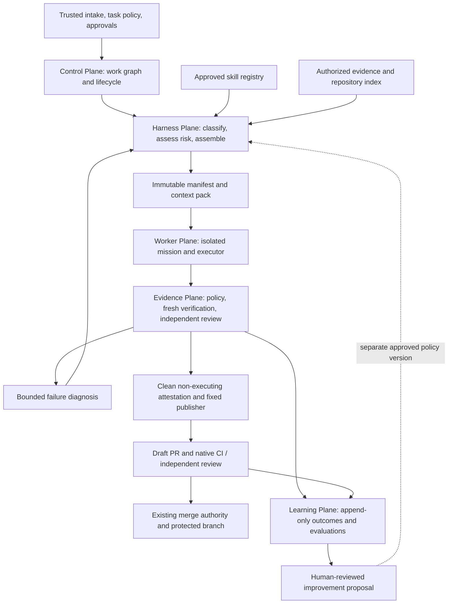

# Forge Harness Plane

**Status: Draft / Proposal — not approved, implemented, or enabled.**

- Date: 2026-09-19.
- Decision owner: repository owner; architecture and security review required.
- Baseline inspected: `atulg4/agentic-sdlc` at
  `89c8dadffc8e83fad5316951bafc6d79e3d0c18c`. The original draft was written
  against `d91b31aabf3f392fa0d3bd855ab7c010c54c804b`; the current-state
  assessment has been re-checked against the newer baseline, which added the
  usage ledger discussed in section 12.
- Origin: the owner's “Harness engineering for Forge” conversation and request
  for a reviewable architecture proposal for a generic software factory.
- Scope of this change: documentation only. All new modules, fields, formats,
  policies, limits, and commands below are proposed contracts, not current APIs.

## 1. Decision requested

Add a **Harness Plane** that assembles each approved unit of work from:

> Mission + versioned skills + permitted context + bounded tools + eligible
> executor + shared budget + mandatory evidence gates.

Reuse Forge's control plane and existing contracts. Make the assembly an
immutable **Harness Manifest** whose decisions can be replayed and reviewed.
Start with one documentation harness and one Python bug-fix harness in shadow
mode. Broader specialization must earn its complexity through measured results.

The owner is being asked to review this direction and the phase gates in
section 13, not to approve an implementation, a new provider, autonomous merge,
or production deployment. An accepted decision should be recorded in an ADR
following [Governance](../governance.md) and
[ADR 0001](../adr/0001-separated-agentic-control-plane.md).

### Goals and non-goals

Goals are to reduce repeated repository discovery and irrelevant context,
improve first-pass correctness, make risk and permissions explicit, and measure
total cost per accepted outcome across providers and consumer repositories.
The architecture must remain useful for unfamiliar repositories: project
policy and small skill bundles provide specialization without hard-coding
MarketMaestro into the platform.

This proposal does not replace the state machine, invent another scheduler,
give workers approval authority, enable a swarm on every task, install skills
from the internet at runtime, or change branch protection. It does not promise
a percentage saving. Token counts, monetary limits, and performance examples
from the conversation were illustrative, not measured Forge results.

## 2. Current-state assessment

The repository already implements several components described as additions in
the conversation. The integration work is more specific than adding agents.
The following assessment is of source at the baseline above, not proof that
every consumer has enabled every workflow.

| Area | Existing evidence | Proposed increment |
|---|---|---|
| Lifecycle, intake, recovery | [`orchestration.py`](../../src/agentic_sdlc/orchestration.py), [`dispatcher.py`](../../src/agentic_sdlc/dispatcher.py), [`checkpoints.py`](../../src/agentic_sdlc/checkpoints.py): validated transitions, idempotent intake, bounded repair, pinned runs, checkpoint recovery | Bind assembly identity and a durable work-unit budget to existing transitions and runs; no second lifecycle |
| Work decomposition and scheduling | [`work_graph.py`](../../src/agentic_sdlc/work_graph.py), [`adaptive_scheduler.py`](../../src/agentic_sdlc/adaptive_scheduler.py) | Schedule selected missions through the same dependency and concurrency rules |
| Mission registry | [`missions.py`](../../src/agentic_sdlc/missions.py), [mission contracts](../missions.md): versions, scope, capability checks, independence, budgets; already includes test author, security/architecture reviewers, release validator, context builder | Compose skills with existing missions; add archetypes only where contracts differ |
| Knowledge and packs | [`knowledge.py`](../../src/agentic_sdlc/knowledge.py), [knowledge docs](../knowledge.md): authorized sources, normalized evidence, redaction, citations, deduplication, freshness, immutable pack digests | Task-specific retrieval, symbol/test mapping, token-aware packing, cache provenance, complete rendered-input digest |
| Executor routing | [`executors.py`](../../src/agentic_sdlc/executors.py), [routing](../routing.md): capability/risk/quality/context/capacity/provider constraints, expected cost, configured alias ordering and recoverable fallback | Separate task, skill, mission, and model selection; apply one assembled risk and cumulative budget to all candidates |
| Deterministic risk | [`policy.py`](../../src/agentic_sdlc/policy.py): forbidden paths deny, protected paths imply high risk, all-low-risk paths imply low risk, other diffs medium; limits can deny | Versioned per-path minimum-risk rules plus task/capability signals, checked before dispatch and on every actual patch |
| Verification and publication | [`gates.py`](../../src/agentic_sdlc/gates.py), [`reusable-implement.yml`](../../.github/workflows/reusable-implement.yml), [security](../security.md): separate generation, verifier, non-executing attestation, publisher | Carry harness identity through the existing evidence chain; skills cannot substitute for mandatory checks |
| Failure handling | [orchestration](../orchestration.md), [`review_continuation.py`](../../src/agentic_sdlc/review_continuation.py), reusable repair and transient-retry workflows | Add narrow diagnosis packets and specialist selection; reuse failure classes, counters, and stale-head checks |
| Learning and provenance | [`efficacy.py`](../../src/agentic_sdlc/efficacy.py), [efficacy](../efficacy.md), [`event_ledger.py`](../../src/agentic_sdlc/event_ledger.py), [`usage_ledger.py`](../../src/agentic_sdlc/usage_ledger.py), [usage accounting](../usage-accounting.md), [`project_registry.py`](../../src/agentic_sdlc/project_registry.py) | Attribute outcomes to harness/skill/cache versions; human-approved, out-of-sample comparisons |

### Existing boundaries that must survive integration

`MissionRegistry` already rejects critical-risk missions for autonomous
dispatch. A model with a critical-risk routing preference does not override
that rejection. `Orchestrator` requires human merge and rejects configuration
that disables it. That hard lock is distinct from
`ProjectPolicy.human_merge_required` in [`policy.py`](../../src/agentic_sdlc/policy.py),
a consumer-configurable flag `Orchestrator` never reads: when it is false,
`evaluate_diff` may report `automatic_merge_allowed` and omits
`human-merge-approval` from `required_gates`. Nothing consumes
`automatic_merge_allowed` today, so the flag is currently inert, but any
manifest deriving its mandatory gate set from `PolicyDecision.required_gates`
would inherit that omission. Open question 4 records the decision.
Separately, [`autonomy.py`](../../src/agentic_sdlc/autonomy.py)
and [`merge_executor.py`](../../src/agentic_sdlc/merge_executor.py) implement a
fail-closed protected-merge boundary with trusted gate evidence and an exact
head SHA; the repository also ships its reusable workflow. Their existence
does not establish consumer enablement. Older operating/security docs describe
auto-merge as disabled in v0.1. This proposal does not reconcile that governance
history by changing behavior: preserve the active consumer's separately
approved controls, retain human merge in the orchestration path, and leave any
protected-merge executor outside the Harness Plane.

Likewise, the existing `release-validator` explicitly validates **without
deploying**. Release-state observations in the event ledger confer no authority.
The conversation's suggestion of a release worker that executes deployment is
excluded from this design.

## 3. Planes and ownership



This is a responsibility diagram, not a replacement workflow ordering. The
existing draft publisher may precede PR-level independent review; merge still
requires the applicable exact-head checks and independent review. Attestation
must always occur after fresh verification and before publication.

| Component | Responsibility and output | Authority limit |
|---|---|---|
| Control Plane | Own work IDs, approvals, dependencies, cancellation, dispatch and checkpoints | Only existing actors may transition states |
| Harness assembler | Resolve trusted inputs; emit manifest, context references, decision trace | No AI credentials, repository writes, approval, or deployment |
| Worker Plane | Execute one mission; emit typed artifacts and bounded summaries | Intersection of policy, mission, harness and sandbox permissions |
| Evidence Plane | Evaluate actual patch, run gates, validate review and attest immutable artifacts | Changed code never handles publishable artifacts or credentials |
| Learning Plane | Reports, experiment proposals and rollback recommendations | Cannot install a skill, change live routing, approve, merge, or deploy |

The initial assembler should be a deterministic library call in the existing
preparation/dispatch path. Unknown classifications can request a bounded,
read-only triage mission; its suggestions remain untrusted input to policy.
No new always-on service is required. Proposed implementation seams are
`harness.py`, `skills.py`, `context_builder.py`, and `repo_index.py` within
`src/agentic_sdlc/`; these files are not introduced by this documentation PR.

## 4. Harness Manifest contract

### Identity, schema and validation

Use a versioned JSON wire object; YAML below is a readable illustration of that
object. A future strict JSON Schema and semantic validator are both required.
Reject duplicate keys, unknown fields, unknown enum values, unsupported schema
versions, unbounded/negative limits, non-finite costs, unresolved references,
and inconsistent identities. There are no permissive defaults for authority.
Registry IDs never resolve through a worker-controlled URL or shell command.

One manifest describes **one mission attempt**. A work unit links its manifests
through a shared budget ledger and lineage, so splitting work, restarting,
switching providers or creating a repair does not reset allowances. A reusable
harness recipe is a separate approved registry entry; a run manifest is its
fully resolved instantiation. Configuration is loaded from pinned protected
policy, never from the candidate patch.

| Required field | Proposed type and semantics |
|---|---|
| `schemaVersion` | Integer `1`; version of this new manifest format, independent of existing schemas |
| `harness` | `{id, version, recipeDigest}`; stable ID, semantic version, SHA-256 of approved recipe |
| `work` | `{projectId, workRef, unitId, taskSpecDigest, baseCommit, candidateTree, publishedHeadCommit, patchDigest}`; exact repository/task; generation uses explicit null tree/head/patch, pre-publication verification binds tree/patch, PR review additionally binds published head |
| `lineage` | `{attemptId, parentManifestDigest, budgetLedgerId}`; unique attempt, nullable parent only for initial attempt, shared durable ledger |
| `policy` | `{platformCommit, projectPolicyCommit, projectPolicyDigest, missionRegistryDigest, skillRegistryDigest, routingPolicyDigest, riskPolicyDigest}`; immutable approved inputs, no branch names as identities |
| `classification` | `{taskType, domains, complexity, evidenceRefs}`; bounded enums/tags, cited evidence; uncertainty represented explicitly |
| `risk` | `{effective, ruleMatches, decisionDigest}`; `low/medium/high/critical`, all matched rule IDs, digest of deterministic assessment |
| `mission` | `{id, version, contractDigest, requiredCapabilities, independentOf}`; resolves to an existing or separately approved `MissionSpec` and its constraints |
| `skills` | Array of `{id, version, contentDigest}` in explicit application order; pinned dependency closure, no floating versions |
| `context` | `{packDigest, renderedInputDigest, indexSnapshotDigest, sourceRevisionDigest, tokenizerId, inputTokenLimit, outputTokenReserve, requiredEvidenceRefs, exclusions}`; index may be null on a cold build; no omitted mandatory evidence |
| `permissions` | `{readPaths, writePaths, toolProfileId, networkProfileId, commandProfileIds, denyCapabilities}`; approved references, not arbitrary commands; empty write list means read-only |
| `executor` | `{executorId, adapterVersion, provider, model, modelAlias, routeDecisionDigest}`; resolved identity selected by existing router; no secrets or credential references |
| `budget` | `{maxCostUsd, maxTotalTokens, maxRuntimeSeconds, maxModelCalls, maxRepairCycles, maxConcurrentMissions}`; positive finite ceilings except zero repairs permitted; effective minima with remaining shared budget |
| `verification` | `{requiredGateIds, additionalGateIds, requiredArtifactTypes}`; union with existing gates; cannot remove, replace, skip, or redefine a mandatory gate |
| `escalation` | `{failurePolicyId, maxContextExpansions, terminalAction}`; bounded approved policy; terminal action `block-and-escalate` |

"Mandatory" in the `verification` row is not left to the validator to infer.
Phase 1 must name a single source of truth — the expectation is the union of
`PolicyDecision.required_gates` and the risk-tier additions in section 8 — and
a manifest schema validator must reject any manifest whose `requiredGateIds`
omits a member of that set. Because a consumer can currently switch
`human-merge-approval` out of `required_gates` (section 2), that derivation
must also state whether the policy-level opt-out is permitted to reach a
manifest at all.

Every object is closed to extra keys, including nested ones. Path lists use
repository-relative normalized paths/patterns, checked against actual file
operations and patch entries, not just against pattern strings. Digests are
lowercase 64-hex SHA-256; Git commit identities use the supported repository
object format (currently 40-hex in Forge's merge contract). `workRef` must
resolve inside `projectId`; source/patch/pack/route references must belong to
the same work unit and approved repository scope.

Serialize the resolved JSON with sorted object keys, UTF-8, no insignificant
whitespace or non-finite numbers. Preserve semantically ordered arrays; sort
set-valued fields during normalization. Hash these bytes as `manifestDigest`
in an outer artifact envelope, avoiding a self-referential hash. Store creation
time and producer identity in that envelope; timestamps do not affect replay.
Validation must recompute the hash and verify the producing workflow/run and
approved policy provenance. A hash alone is integrity, not authorization.

### Example: illustrative Python bug-fix attempt

All `<...>` strings stand for values that must be resolved before validation.
The example is deliberately not a deployable policy; costs are a hypothetical
budget, not a provider price. Generation receives source and permitted editing
tools; tests run in the separate verifier described in section 10.

```yaml
schemaVersion: 1
harness:
  id: python-bug-fix
  version: 1.0.0
  recipeDigest: <approved-recipe-sha256>
work:
  projectId: owner/example
  workRef: owner/example#42
  unitId: example-42
  taskSpecDigest: <normalized-approved-task-sha256>
  baseCommit: <exact-protected-base-sha>
  candidateTree: null
  publishedHeadCommit: null
  patchDigest: null
lineage:
  attemptId: example-42-implementation-1
  parentManifestDigest: null
  budgetLedgerId: example-42-budget
policy:
  platformCommit: <approved-platform-sha>
  projectPolicyCommit: <protected-policy-sha>
  projectPolicyDigest: <project-policy-sha256>
  missionRegistryDigest: <mission-registry-sha256>
  skillRegistryDigest: <skill-registry-sha256>
  routingPolicyDigest: <routing-policy-sha256>
  riskPolicyDigest: <risk-policy-sha256>
classification:
  taskType: bug
  domains: [python, api]
  complexity: bounded
  evidenceRefs: [task-spec, affected-paths]
risk:
  effective: medium
  ruleMatches: [default-medium]
  decisionDigest: <risk-decision-sha256>
mission:
  id: implementation-worker
  version: 1.0.0
  contractDigest: <mission-contract-sha256>
  requiredCapabilities: [edit-code, author-tests, run-commands]
  independentOf: []
skills:
  - id: python-regression-fix
    version: 1.0.0
    contentDigest: <skill-bundle-sha256>
context:
  packDigest: <existing-context-pack-sha256>
  renderedInputDigest: <complete-rendered-input-sha256>
  indexSnapshotDigest: <repository-index-sha256>
  sourceRevisionDigest: <authorized-source-revisions-sha256>
  tokenizerId: <pinned-tokenizer-id>
  inputTokenLimit: 24000
  outputTokenReserve: 8000
  requiredEvidenceRefs: [task-spec, project-rules, affected-source, regression-test]
  exclusions: []
permissions:
  readPaths: [src/**, tests/**, docs/**]
  writePaths: [src/api/**, tests/api/**]
  toolProfileId: isolated-patch-editor-v1
  networkProfileId: approved-model-endpoint-only-v1
  commandProfileIds: [trusted-repository-inspection-v1]
  denyCapabilities: [merge, deploy, production-secrets, edit-governance]
executor:
  executorId: <eligible-registry-executor>
  adapterVersion: <pinned-adapter-version>
  provider: <approved-provider>
  model: <configured-provider-model>
  modelAlias: <stable-alias>
  routeDecisionDigest: <route-decision-sha256>
budget:
  maxCostUsd: 2.00
  maxTotalTokens: 60000
  maxRuntimeSeconds: 1200
  maxModelCalls: 4
  maxRepairCycles: 1
  maxConcurrentMissions: 1
verification:
  requiredGateIds: [deterministic-ci, independent-agent-review, human-merge-approval]
  additionalGateIds: [targeted-api-regression]
  requiredArtifactTypes: [patch, patch-manifest, gate-report, review-report]
escalation:
  failurePolicyId: bounded-diagnostic-repair-v1
  maxContextExpansions: 1
  terminalAction: block-and-escalate
```

`run-commands` in the mission is a capability requirement, not permission to
run arbitrary code. The effective command profile further narrows it. Likewise,
the manifest references downstream review/merge evidence; the implementation
worker cannot produce its own review or human approval.

### Dispatch and artifact binding

Add an explicitly versioned extension to `create_dispatch_envelope` and
`AgentRunRecord` for `manifestDigest`; do not silently change the existing
envelope digest algorithm. Keep legacy records readable and marked as having
no harness identity. New workers verify all references before acquiring work.
After generation, trusted code binds base commit, patch digest, resulting Git
tree and originating manifest digest into the patch provenance envelope.
Downstream attempts receive new immutable manifests with those resolved fields.
Today's verifier and publisher independently create commits with different
messages and potentially different SHAs from the same patch. Therefore
pre-publication identity is **repository + base + patch digest + candidate tree**,
not the verifier's temporary commit SHA. The clean attestor reconstructs that
tree independently. After publication, the fixed publisher records the actual
head commit and verifies its parent/tree against the attested identity; native
CI and PR review bind that exact published head. This is an explicit evidence
link, not acceptance of the verifier's commit as the PR head. A changed head,
policy revision, revoked skill or expanded scope requires new validation and
a new manifest; equal tree contents do not make an old-head review current.

Existing patch artifact base/repository/work-request/byte-length/hash binding
remains mandatory. Attestation reconstructs from the immutable original patch
in a fresh job and independently validates the entire binding. Publisher and
merge gates reject stale or mismatched evidence. A cancelled, superseded or
blocked unit cannot resume just because an old manifest remains validly hashed.

## 5. Skill Registry

Use a small platform registry plus explicitly approved consumer extensions.
Suggested storage is `skills/<domain>/<id>/` containing `SKILL.yaml`,
`instructions.md`, optional examples, and references to deterministic checks.
Domain families may cover engineering, backend, frontend, data, infrastructure,
security, quality and release validation. Start with a few validated skills,
not the entire taxonomy from the conversation.

| Skill metadata | Contract |
|---|---|
| Identity | `id`, semantic `version`, complete bundle `contentDigest`, owner, origin and approved revision |
| Applicability | Task/domain tags, supported mission versions, required existing capabilities, prerequisite skills pinned by digest |
| Inputs | Required evidence types, optional examples and an estimated instruction token cost |
| Behavior | Bounded instruction file, explicit success criteria and anti-patterns |
| Checks | References to approved verifier command profiles; never inline model-authored shell |
| Compatibility | Conflicts, superseded versions, minimum platform/schema version, deprecation/revocation status |
| Evaluation | Fixture-suite version and linked results; declared competence is not evaluation evidence |

For example, `python-regression-fix` guides a worker to describe a failing
regression, propose the minimum fix and preserve assertions. It requests
verifier evidence for failure-before/fix-after when applicable. It cannot
instruct the generator to execute modified tests beside AI credentials.

The selector first filters by policy, compatibility and required capabilities;
then chooses a deterministic bounded set using task tags, declared dependencies
and explicit priority. Reject dependency cycles, ambiguous duplicate IDs,
conflicting instructions that cannot be resolved by trusted priority, and
missing mandatory skills. Record rejected candidates and tie-breaks. Optional
skills can be omitted under context limits with recorded exclusions; mandatory
skills cannot silently disappear.

Skills are supply-chain inputs with executable influence. Pin their bytes and
review updates like policy. A consumer extension cannot replace a platform
skill under the same ID or weaken platform constraints. Revocation prevents
new dispatch and invalidates dependent queued manifests; in-flight work stops
at the next enforcement boundary, and publication rechecks revocation.

Before enabling the registry, protect skill bundles, harness recipes, registry
indexes, risk rules and command/tool/network profiles from ordinary worker
patches, including indirect imports and nested copies. Existing denied policy,
mission, knowledge and agent-instruction files stay denied. Protection is an
implementation prerequisite, not an assertion that these proposed paths are
already covered by today's policy. Skills confer no tool, secret, source or
repository access. Scripts, if later supported, execute only as pinned,
reviewed tools in the appropriate credential-free sandbox.

## 6. Context Pack Builder

Extend `knowledge.build_context_pack`; do not introduce a competing knowledge
store or replace its access checks, stable record IDs, citations or freshness
behavior. Its existing limits are records and payload bytes; token-aware
retrieval and complete prompt accounting are additional work.

1. Resolve the approved task, full applicable project constraints, mission,
   permitted sources and exact repository revision. Treat task text, source,
   comments, logs and previous agent output as untrusted evidence.
2. Retrieve likely symbols, imports, tests, owners and architecture notes from
   the repository index, then verify referenced blobs against the pinned tree.
   Use deterministic search/parsers first; a model may suggest missing links.
3. Select direct source, interface contracts and relevant tests before optional
   history/examples. Required security/policy/acceptance information is never
   truncated to hit a target. A small task does not imply a small required pack.
4. Normalize with existing adapters, authorize sources for the downstream
   mission, redact before persistence/provider transfer, deduplicate and expose
   contradictions. Load protected instruction files as trusted policy only
   through the approved-policy path; candidate versions remain evidence.
5. Budget the **whole rendered model input**: trusted wrapper, task, skills,
   evidence, tool definitions and retained conversation, plus output reserve.
   Check against both the selected executor window and shared token budget.
   Iterate packing and executor selection deterministically with bounded
   attempts; if mandatory context cannot fit, block with a reason.
6. Emit the existing `ContextPack`, selection reasons, source coverage,
   missing/stale evidence, token accounting, and a digest of the actual rendered
   input. The current pack digest alone is not proof of complete prompt content
   or current authorization; revalidate both before dispatch.

High/critical-risk incomplete or stale evidence remains blocking. For lower
risk, the existing qualified-pack behavior may retain explicitly identified
stale evidence, but it cannot qualify away missing mandatory task, policy,
security or acceptance constraints. Qualified operation must be explicitly
allowed by protected policy and remain visible to reviewers.

If the worker needs more context, it returns a typed request with paths/symbols
and a reason. The builder rechecks access, remaining budget and expansion cap,
then creates a new pack/manifest in the same lineage. An expansion is never an
implicit wider permission grant. Handoffs contain concise factual findings,
artifact references and unresolved questions, not private reasoning traces.

## 7. Repository intelligence cache

Cache deterministic facts rather than conversations: file/blob identities,
language symbols, imports/dependencies, test relationships with their evidence,
ownership, risk-surface hints, and cited architecture summaries. Existing
knowledge records remain the interchange format. LLM summaries are explicitly
derived, untrusted and separately versioned; they never override source or
policy and cannot lower risk.

Key each snapshot by repository/security scope, exact commit/tree, index schema,
parser versions, configuration digest and authorized source revision set.
Private repositories and differently authorized missions never share a cache
entry merely because content hashes match. Model-provider prompt caching is a
separate optional mechanism subject to the same data-use policy.

Incremental updates reparse changed blobs and invalidate dependent symbols and
test mappings; renames, deletions, dependency lockfiles and parser/configuration
changes also invalidate affected entries. Verify ownership/risk rules from the
trusted base each time. Unknown dependency effects cause conservative rebuild,
not reuse by timestamp. Coverage-based test maps need the producing candidate
and tool versions; historical coverage is a hint, never permission to skip
mandatory native CI.

Build indexes without importing repository modules or running project setup
scripts. Reject path traversal, symlink escapes and unapproved submodules;
bound file sizes and parser resources. Untrusted PR jobs cannot populate a
trusted default-branch cache. A generation overlay belongs only to its exact
candidate and is discarded or rebuilt after merge from the protected tree.

Cold/missing/corrupt cache entries trigger deterministic source retrieval or a
fresh rebuild. If required evidence remains unavailable, block according to
section 6. Cache access is authorized on every read; deletion, retention expiry,
source revocation and permission changes invalidate dependent packs. Store no
credentials, production data, raw auth or unnecessary full logs. Record hits,
misses, rebuild cost, retained bytes and freshness failures to test whether
caching actually pays for itself.

## 8. Deterministic risk mapping

Extend the existing policy evaluator with an approved, versioned set of rules;
do not let a model choose its own safety tier. Keep denial separate from risk:
a forbidden path is blocked even if a risk rule calls it low.

```text
allowed = existing_task_and_diff_policy_allows AND no_new_policy_denial
effective_risk = max(existing_applicable_risk,
                     mission_risk_floor,
                     task_and_capability_rule_floors,
                     every_matching_path_floor,
                     earlier_effective_risk_for_this_work_unit)
```

At intake, use the existing task decision (normally medium) and approved planned
scope. At patch evaluation, use the actual diff decision as another floor.
Unknown/unresolved scope stays at least medium or the consumer's stricter
default. Thus an intake medium task does not automatically become low just
because its eventual diff contains only documentation; a separately reviewed
intake policy change would be needed for that optimization. This is intentional
until the lifecycle's risk semantics are reconciled.

Example proposed consumer rules (illustrative paths, not claims about a live
MarketMaestro configuration):

| Rule | Trigger | Minimum / effect |
|---|---|---|
| Governance deny | Current forbidden paths plus new harness/skill/policy inputs | Deny ordinary worker edits, independent of risk |
| Auth boundary | `src/auth/**`, `src/security/**`, auth/session capability | High; architect/security review |
| Critical finance | `src/trading/**`, `scripts/confidence_engine.py` | Critical; stop autonomous dispatch and require human disposition |
| Accountability | `src/accountability/**` | High; domain and security review |
| Data migration | Consumer-declared migration paths or schema migration task | High; migration/rollback evidence |
| Docs candidate | `docs/**`, excluding governance and any higher matches | Low floor only; never overrides another floor or denial |
| Unknown/default | No complete matching scope | At least medium; record uncertainty |

Normalize actual Git path entries; evaluate old **and** new names for renames,
deleted files, mode changes, submodules and the complete patch, not just model
declared files. Preserve existing glob behavior or explicitly version and test
any replacement; specify case sensitivity and slash handling per supported
platform. Malformed paths/patterns fail closed. All overlapping rules apply;
highest floor and union of required gates win regardless of rule ordering.

Recompute before dispatch, after every patch/repair, before attestation, and
when base/policy changes. A newly higher floor suspends the current attempt,
invalidates incompatible route/review evidence and requires a new manifest,
appropriately cleared worker and required approvals. Preserve the original
patch for audit. Never relabel a high-risk edit as low to save cost. Critical
risk remains non-autonomous under the current mission validator; a stronger
model is not a bypass. Risk-rule changes need a human-controlled policy review.

## 9. Specialist missions and four routing layers

Specialization should usually be a mission plus selected skills, not another
long-lived agent service or a hard-coded agent per framework.

| Mission/archetype | Starting point | Contract and evidence |
|---|---|---|
| Triage, architecture/specification | `specification-planner`, `architecture-reviewer` | Read-only scope/classification/plan or independent architecture report |
| Repository scout | `context-builder` plus deterministic index tools | Cited map and permitted evidence pack; no source writes |
| Backend / frontend implementation | `implementation-worker` plus API/UI/accessibility skills | Bounded source/test patch, assumptions, no governance writes |
| Test design | `test-author` | Frozen interface/acceptance contract, tests-only patch, no weakening existing assertions |
| Database migration | Separately reviewed narrower implementation contract | Migration patch, compatibility/rollback evidence in verifier; no live database credentials |
| Security / performance analysis | `security-reviewer` or proposed read-only analysis mission | Threat/performance report; benchmark execution delegated to verifier |
| Dependency update | Separately reviewed bounded implementation contract | Approved manifest/lockfile scope and compatibility/security evidence; no autonomous governance changes |
| Bug diagnosis / repair | `repair-agent` with diagnostic skill | Failure packet, minimal patch, bounded attempts and new verification |
| Independent review | Existing code/security/architecture/data/quant reviewers | Exact-candidate structured findings; cannot review own writes |
| Documentation | `documentation-agent` | Relevant docs patch excluding protected instructions/policy |
| Release validation | Existing `release-validator` | Approved release evidence only; no deployment |

Mission extensions use the existing closed capability universe. New capabilities
require a platform contract change; consumer skills cannot invent them. Worker
independence excludes every contributor to source **and tests**, including
repair authors, with durable identity across fallback/restarts. A new alias
for the same agent must not create independence. Prefer a different model
family when permitted and evaluated, but provider diversity alone proves
neither independence nor correctness. Reviews get fresh contexts and do not
inherit an implementer's verdict.

| Router | Input → decision | Enforcement |
|---|---|---|
| Task | Approved spec + deterministic repository signals → task type, domain, uncertainty | Model classification is advisory; unresolved scope blocks unsafe dispatch |
| Skill | Task + mission constraints + approved registry → minimal compatible skill closure | Digests, compatibility, required skills, policy and context budget |
| Worker/mission | Required artifacts/capabilities/risk → mission contract and eligible worker roster | Existing mission selection, independence, write scope, concurrency and dependency rules |
| Model/executor | Resolved mission/context + remaining budget → eligible executor and adapter | Existing provider, residency, data-use, risk, quality, capacity and context gates |

The assembler resolves mission requirements early enough for skill filtering,
then validates the entire composition before dispatch; these are distinct
decisions, not four network services. The worker profile and selected executor
must describe the same adapter/provider/model and satisfy both registries;
reject a mismatch rather than recording one route while running another.

Use deterministic tools for syntax, lint, schema validation, graph lookups and
tests. The current executor router ranks configured alias preference before
expected cost per successful mission. Preserve this ordering initially; changing
it to learned rankings requires a versioned, evaluated policy proposal. Capacity
fallback is distinct from a quality repair escalation. Each fallback rechecks
remaining work-unit budget, source/provider authorization and independence;
no eligible executor means an explicit blocked result.

### Example assembly decisions

An API regression uses relevant Python/API/test skills with one implementer,
fresh verification and an independent reviewer. A CSS spacing fix uses UI and
visual/accessibility context; it still receives the applicable review and merge
gates. OAuth work adds a security reviewer and at least the auth-path floor.
A critical-risk trading change stops autonomous dispatch. These examples do
not assume that any particular model is qualified or that a fixed team size is
necessary.

Parallel test authoring is optional, only against a frozen interface with
isolated workspaces and non-conflicting scopes. Reconcile patches through the
existing graph/scheduler and verify the combined candidate. Never share a
mutable checkout or accept separate passing patches as proof the union passes.

## 10. Permissions and trust boundaries

Effective permissions are the **intersection** of platform policy, protected
consumer policy, mission scope, resolved harness and runtime sandbox. Denials
win. Prompt instructions describe permissions; sandbox/tool mediation and
fresh patch checks enforce them. Enforce read scope as well as write scope,
including symlinks, subprocesses, network egress and generated files.

| Job/actor | Permitted work | Credentials / prohibited authority |
|---|---|---|
| Preparation / assembler | Read approved configuration and build manifest | Existing optional framework read token only; no AI or publication authority |
| Context retrieval / index | Read approved sources and build sanitized evidence | Source-specific least-privilege access, isolated from workers; no production/broker credentials |
| AI implementer / test author | Read permitted pack; edit bounded isolated patch | AI credential through approved adapter; no repository write/merge/deploy token; no changed-code execution |
| AI reviewer | Read authorized exact candidate and verifier reports | Independent AI context; no edits, repository write credential, approval of own work or execution of candidate code |
| Verifier | Run trusted gate definitions against candidate in fresh sandbox | No AI, publishing, production or broker credentials; cannot create final publishable artifact |
| Attestor | Reconstruct original patch; validate policy/digests after verifier succeeds | Trusted code only, no execution of candidate or consumer scripts |
| Fixed publisher / review-comment publisher | Publish only validated artifacts or structured review | Existing scoped tokens, no AI credential; fixed operations and no agent-chosen commands |
| Merge / release boundary | Existing independently authorized process | Outside all worker/skill/harness authority; existing human/environment approvals and branch rules remain |

Keep the existing native-token branch push and dedicated App-token draft-PR
creation separation. Do not put secrets into manifests, cache keys, skills,
packs, routing files or prompts. Provider restrictions apply before any source
is sent, including fallback and triage. A new source adapter or provider needs
its own approval/conformance review; a skill cannot introduce one implicitly.

Repository test commands are code execution even when named “test” or “lint”.
Skills may ask for test evidence, but execution occurs in the credential-free
verifier. Network access is denied by default outside explicitly approved
endpoints and verifier needs. Adding service containers or package downloads
requires protected verifier configuration, not an agent tool grant.

## 11. Diagnostic repair and recovery

Reuse the existing failure classes and bounded continuation workflow. Before
calling another model, construct a sanitized **Failure Packet** containing
repository/work identity, exact base/head and patch digest, manifest/pack
digests, command ID and exit status, bounded relevant errors, affected symbols,
test/gate evidence, prior attempts, remaining budget and unresolved findings.
Worker diagnoses are hypotheses, not trusted failure classifications.

| Existing class | Harness action | Stop condition |
|---|---|---|
| `transient_infrastructure` | Existing exact-head, idempotent bounded retry; no coding agent | Existing retry/backoff limit or changed head |
| `deterministic_code_or_test` | Diagnose from evidence; route code fix to implementer or justified test fix to test specialist | Shared repair/runtime/spend limit, no progress, incompatible scope |
| `review_changes_requested` | Narrow repair mission using validated exact-candidate findings | Existing review-repair cap or unresolved security/policy issue |
| `policy_or_security_block` | Preserve evidence and block for authorized human disposition | No automatic override or cheaper fallback |
| `unknown` | Bounded evidence collection; then human escalation | Insufficient evidence; never label unknown as transient merely to retry |

Classifying a test as wrong requires evidence against the approved contract
and independent review; deleting tests, skipping them or weakening assertions
to obtain green CI stays prohibited. Context omission may justify one bounded
pack expansion. Repeated identical failure fingerprints trigger escalation
instead of another identical call. A stronger model is considered only after
scope, evidence, tool and environment causes are assessed, and only if the
same policy and remaining budget permit it.

Every changed patch gets fresh deterministic verification, attestation and
independent review as required by the existing path. Prior-head/cycle approvals
cannot be reused. Repairs, expansions, provider fallbacks and infrastructure
retries remain separate counters under one cumulative work-unit accounting
record; no nested retry loop multiplies the allowance. Current draft/non-draft
eligibility checks in continuation workflows remain intact.

Reserve budget atomically before dispatch and settle actual usage afterward.
Checkpoint reservation and attempt IDs before making external calls. On crash,
recover the same reservation; do not issue a duplicate call unless its outcome
is known or the unresolved spend is conservatively reserved. Preserve consumed
budget across cancellation and supersession for the same approved work budget.
New human-approved budget is a recorded decision, not a worker reset.

## 12. Efficacy, cost and learning loop

Extend existing `RunOutcome` and append-only ledgers with a versioned harness
attribution record: manifest/recipe/skill digests, task/domain/risk cohort,
executor and routing-policy identity, context/index versions, input/output and
cached tokens, index/retrieval/verification costs, failed calls, retries,
latency, review outcomes, later defects/reopens and human intervention.
Use compatible versioned readers; historical outcomes with missing attribution
remain visible as unknown, not retrospectively assigned to the new harness.
Monetary capture is no longer missing. Since this proposal's original
baseline, [`usage_ledger.py`](../../src/agentic_sdlc/usage_ledger.py)
([usage accounting](../usage-accounting.md)) has landed on `main`: every
dispatched activity gets one immutable `UsageRecord` carrying an optional
pre-dispatch estimate, post-run actual and infrastructure usage, with versioned
pricing snapshots, explicit unknowns rather than fabricated numbers, and
subscription capacity kept separate from billed dollars. Two gaps remain for
this design. `RunOutcome` in `efficacy.py` still carries only aggregate
token/runtime fields and no monetary field. Neither ledger records harness
attribution: `UsageRecord` keys on work unit, stage, mission, run and attempt,
but has no manifest, recipe, skill or cache-version field. The increment here
is that attribution plus a versioned join between the usage and outcome
ledgers, which must exist before the pilot, not wait for learned routing.

Late reviews, billing reconciliation, merges, defects and reopens are new
immutable observation events referencing a stable run/outcome and work-unit
identity, with unique event ID, producer, timestamp and evidence. They never
rewrite an `OutcomeLedger` record or create an extra execution merely to update
a flag. A versioned as-of projection joins and deduplicates observations,
counts each execution once in run-based metrics, and counts each accepted
change once in change-based denominators. Reports pin their observation cutoff;
later reports can incorporate later events without rewriting prior evidence.
Pending billing and unfinished defect windows remain explicit unknowns, not
zero spend or proof of defect-free operation. Legacy metric formulas remain
versioned and unchanged; the new projection requires separate metric versions.

Report several measures, not a single model leaderboard:

| Measure | Definition / guardrail |
|---|---|
| Total cost per accepted change | All attributable generation, review, repair, retrieval/index and verification spend in the cohort divided by accepted changes; zero accepted means undefined, not zero |
| First-pass quality | Verification/review acceptance before repair, with explicit observed denominators and missing-data counts |
| End-to-end success | Approved acceptance evidence achieved; generated patch alone is not success; merge/live outcomes tracked separately |
| Safety and escaped defects | Policy violations, security findings, reopens and post-merge defects over a fixed observation window |
| Efficiency | Tokens, model calls, repair cycles, cache reuse, total/p95 latency and human effort, including failures and abandoned work |

Budget enforcement uses finite hard ceilings for calls, tokens, elapsed time,
concurrency and cumulative spend. Preflight estimates alone are not a hard
dollar cap: reserve worst-case request cost from versioned approved rates and
output limits; keep unknown usage reserved and stop additional calls. Compute
the reservation after routing has selected a candidate and against that
candidate's rate, not a generic default. The router already carries a static
`expected_mission_cost` per executor, refuses any candidate whose cost exceeds
the request budget, and sorts eligible candidates by configured alias
preference before expected cost per success (section 9). What it does not
carry is a per-request pinned rate, so binding the reservation to a versioned
`PricingSnapshot` is new Phase 1 work rather than an existing seam. Report
provider billing lag/variance. Subscription capacity and estimated opportunity
cost must be shown separately from API cash spend, not treated as free.

Compare the same task/risk/complexity/provider-policy cohorts with a fixed
baseline, held-out fixtures and comparable review criteria. Include cold-cache
costs, cache invalidation failures and total repair spend. Use the existing
sample-count/confidence-interval reporting and small-cohort refusal rules;
do not import the conversation's hypothetical model success percentages.

Learning produces an evidence-backed correction proposal, then an experiment
changing one bounded variable in shadow or an approved cohort. Data used to
form the hypothesis is excluded from evaluation. Quality/safety non-inferiority
and minimum sample/observation windows must be approved before the experiment;
speed or cost never compensates for worse safety. Promotion requires a named
human approver and existing high-risk proposer/evaluator separation. Rollback
can select only a previously approved policy. No self-modifying skill or live
router optimization is authorized.

## 13. Phased implementation and rollback

Each phase is a separately reviewed implementation PR with source, schema,
adversarial fixtures and migration evidence. Do not add every specialist at once.

| Phase | Work and existing integration points | Exit evidence |
|---|---|---|
| 0 — Baseline and decisions | Inventory active consumer controls; resolve schema/risk semantics; capture comparable task corpus and current cost/quality; approve protected paths and measurements | Owner-approved ADR, threat model and evaluation plan; no runtime change |
| 1 — Manifest and registry in shadow | Strict schema/semantic validator; approved recipe and skill registry; extend envelope/run readers compatibly; add harness attribution and append-only observation/projection contracts; protect new configuration paths | Reproducible manifests, denied malformed/unapproved inputs, old records readable, no duplicated outcome denominators; shadow assembly has no execution authority |
| 2 — Context and repository index | Extend knowledge pipeline with deterministic retrieval, cold-cache fallback, token accounting, access/revocation handling; capture full cost including failed calls and indexing | Required-context coverage, no cross-scope leakage, reproducible invalidation; complete pilot-ready cost/quality baseline with missing-data indicators |
| 3 — One bounded pilot | Enable documentation and Python bug-fix recipes for approved units; integrate risk rechecks, narrow tool profiles, cumulative reservations and existing gates | End-to-end exact-candidate evidence; all permission/repair/restart fixtures pass; existing approval and merge boundaries unchanged |
| 4 — Targeted specialists and diagnostic repair | Add test/diagnosis/security bundles only where pilot shows need; use existing scheduler; expand provider fallback tests | Independent reviewer history, no budget multiplication, conflict handling and full combined-patch verification |
| 5 — Evaluated optimization | Use already-collected harness-attributed outcomes for held-out experiments through existing efficacy machinery | Adequate comparable sample, approved quality/safety bounds and cost benefit, named promotion approval and tested rollback |

Opt-in per consumer at a pinned platform/policy version. Preserve the legacy
path for unselected work with its existing protections; never fall back to it
to bypass a rejected harness decision. Invalid harness configuration, revoked
policy, unresolved provenance or safety failures block affected work.

Rollback disables new harness dispatch, preserves manifests/outcomes/reservations,
cancels or drains in-flight work at an explicit safe boundary, and returns
eligible **new** work to a previously approved legacy or harness version after
policy review. Do not publish in-flight patches with incompatible/revoked
evidence. No database destructive migration or policy downgrade is needed for
this documentation change; future schema migrations need their own rollback
fixtures.

## 14. Alternatives, risks and open questions

### Alternatives considered

- **Only improve prompts:** low integration cost, useful as a baseline, but
  lacks enforceable per-run assembly, scoped caching and reproducible selection.
- **Fixed agent team for every task:** easy to describe, but adds unnecessary
  calls, handoffs and context for simple work; reserve teams for demonstrated
  dependency/independence needs.
- **New orchestration framework or managed agent runtime:** may supply useful
  execution primitives later, but introduces another lifecycle and custody
  boundary. Any adapter must still meet Forge's existing artifact/trust model.
- **One large context pack every time:** simpler retrieval but costly and noisy.
  Retain as a measured baseline; targeted context must prove adequate coverage.
- **Automatic learning-based promotion:** adapts quickly but risks feedback bias
  and policy drift; retain the current human-approved experiment mechanism.

### Risks and mitigations

| Risk | Mitigation / residual concern |
|---|---|
| Skill or cache poisoning / prompt injection | Approved immutable inputs, data boundaries, runtime mediation, provenance and revocation; models may still misinterpret authorized evidence |
| Over-pruned context or stale test maps | Mandatory coverage, cited source validation, conservative rebuild and native CI; semantic gaps still need independent review |
| Risk laundering through rename, docs path or task label | Denials first, all path endpoints, maximum floors and monotonic work-unit risk; initial rule coverage needs domain review |
| Permission drift between mission, executor and sandbox | Validate their intersection and actual file/tool activity; declared scope alone is insufficient |
| Hidden cost in retries, indexing or extra specialists | Shared reservations, full-cohort accounting, cold-cache baselines and phase gates; savings are uncertain until measured |
| Correlated review / agent identity laundering | Durable contributor history, separate context and non-writing reviewers; optional provider diversity is not proof of safety |
| Record/version explosion and migration burden | Small schemas, one envelope extension, explicit compatibility/deprecation and retention; avoid duplicate sources of truth |
| Races across policy/head changes and retries | Exact immutable identities, atomic reservations, revalidation before dispatch/attestation/publication and stale-head rejection |
| Generic factory becomes consumer-specific | Keep paths/domain rules in reviewed consumer configuration, with platform capability and schema contracts |

### Open questions requiring review

1. Should recipes/skills use TOML authoring for consistency with missions and
   knowledge, or YAML authoring with a canonical JSON wire format? The strict
   wire contract and validation requirements should remain format-independent.
2. Which exact protected directories and ownership rules cover all skill,
   recipe, risk, command and tool profile imports before opt-in?
3. Should a docs-only task ever start below today's medium intake floor? If so,
   what deterministic approved scope establishes that without trusting labels?
4. How should active consumers document the relationship between the human-merge
   orchestration path and the separate protected-merge executor? This proposal
   neither enables nor expands the latter. The same question covers the two
   distinct `human_merge_required` flags (section 2): whether a manifest's
   mandatory gate set may ever be derived from a `PolicyDecision` whose
   `required_gates` omits `human-merge-approval`.
5. Which tokenizer/rate source is authoritative per executor, and what upper
   bound or stop policy applies when cost/usage information is missing?
6. Is a local content-addressed index enough for initial consumers? What access,
   retention and revocation model would justify a shared service later?
7. What persistent identity proves reviewer independence across aliases,
   sessions and provider fallback, beyond today's mission/agent history?
8. What minimum comparable sample, defect observation window and non-inferiority
   margins will the owner approve for each risk/task cohort?
9. How should new manifest fields migrate into existing envelopes, outcomes and
   checkpoint records without changing old digests or replay behavior?
10. Which one or two real consumer tasks should form the pilot, and what measured
    failure would stop expansion even if inference spend falls?

## 15. Acceptance criteria and independent review protocol

This proposal is ready for an implementation decision when reviewers agree on
the interfaces, security invariants, pilot and unresolved decisions, and the
owner records acceptance in an ADR. Merging this document alone does not
activate any harness or grant policy approval.

Future implementation must demonstrate the following before phase-3 opt-in:

- [ ] Identical pinned inputs yield identical manifests and rendered-input
  digests; changed skill/policy/pack/patch produces a different identity.
- [ ] Unknown/duplicate schema fields, malformed paths, unsupported versions,
  unapproved recipes, cycles and non-finite budgets fail closed.
- [ ] New registry/control paths are denied to ordinary workers; a modified
  candidate policy/skill cannot influence its own validation.
- [ ] Required context survives packing; insufficient room blocks; stale or
  revoked high-risk evidence blocks; cache misses rebuild without policy bypass.
- [ ] Authorization is enforced at retrieval, cache read, packing and provider
  dispatch; symlink escapes and cross-repository/source leakage are rejected.
- [ ] Overlapping path rules, renames, deletions, newly discovered sensitive
  paths and misleading task labels cannot lower risk or remove gates.
- [ ] Critical-risk work cannot dispatch autonomously; forbidden paths remain
  forbidden regardless of risk, mission, skill or available model.
- [ ] Worker/executor identities agree; writer/test-author/repair history bars
  self-review across aliases and restarts; fallback retains all constraints.
- [ ] Verifier tests cannot alter the attested original patch, obtain AI/write
  credentials or forge publication evidence; every gate binds the exact candidate.
- [ ] Different verifier/publisher commit SHAs are linked through attested
  base/patch/tree identity; native CI and review bind only the published head.
- [ ] Duplicate events, interrupted calls, repairs, context expansions and
  parallel missions cannot reset or overspend the approved cumulative budget.
- [ ] Changed heads and cancelled/superseded/blocked units reject stale review,
  attestation and publication; every repair receives fresh required evidence.
- [ ] Existing human approvals, protected-merge controls, branch protection,
  secret isolation and deployment/environment approvals remain unchanged.
- [ ] Legacy run records are readable; opt-in/disable/rollback and revocation
  are exercised with in-flight work and preserved audit evidence.
- [ ] Comparable held-out evaluation reports quality, safety, complete cost,
  sample sizes and uncertainty; no cost claim uses only successful runs.
- [ ] Late billing/review/defect events do not rewrite outcomes, duplicate
  execution/change denominators or turn missing observations into success.

### Review instructions for Codex/Claude-style reviewers

Review the exact PR base/head and this document as a proposal. Inspect linked
source rather than assuming the conversation's descriptions are current. Work
read-only; propose corrections as findings. Do not enable workflows, install
skills, alter policy, approve your own contributions, merge, or deploy.

Use independent review passes where supported:

| Lens | Questions to answer |
|---|---|
| Architecture | Does this reuse existing contracts without a parallel state machine or registry? Are manifest ownership, lineage, schema evolution and provider portability implementable? |
| Security | Can untrusted skills/source/cache/patches widen scope, leak credentials, lower risk, forge independence or substitute stale evidence? Do current critical-risk and merge/deploy controls survive? |
| Cost and reliability | Is full cost measurable and bounded across fallback/repair/restart? Can retrieval omit a necessary dependency? Are claimed savings testable and failures retained? |
| Maintainability | Are phases small enough, schemas/versioning precise, new concepts necessary, rollback safe and acceptance fixtures actionable? |

Return the reviewed head SHA, lens, overall recommendation, and prioritized
findings with document section/line, source evidence, concrete failure scenario
and suggested correction. Distinguish blockers, design tradeoffs and questions;
state coverage limits and assumptions. “No findings” is not approval to ship.
Re-review changed sections after amendments and mark old-head reviews stale.
AI feedback is advisory; acceptance remains with the repository owner.
